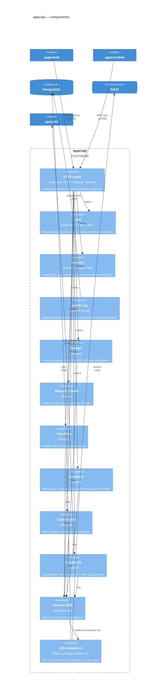

# C4 — Diagrama de Componentes (apps/api)

Backend NestJS organizado en módulos hexagonales (cada módulo: domain, application, infrastructure, http).



## Convención de capas (cada módulo)

```
modules/<dominio>/
├── domain/             # Entidades, value objects, agregados, eventos de dominio
├── application/        # Casos de uso (commands/queries), puertos
├── infrastructure/     # Adaptadores: repos PG, mappers, publishers
└── http/               # Controllers REST + GraphQL resolvers + DTOs zod
```
