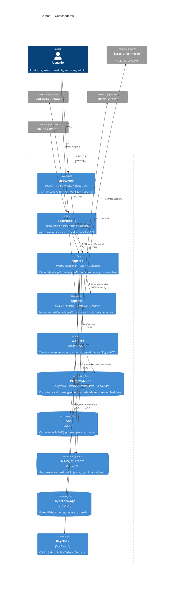

# C4 — Diagrama de Contenedores (Karpos)

```mermaid
C4Container
  title Karpos — Contenedores

  Person(user, "Usuario", "Productor, asesor, cuadrilla, empaque, admin.")

  System_Boundary(karpos, "Karpos") {
    Container(web, "apps/web", "Next.js 14 (App Router) + TypeScript", "Consola web. SSR + RSC. MapLibre + deck.gl.")
    Container(mobile, "apps/mobile", "React Native + Expo + WatermelonDB", "App móvil offline-first. Sync diferencial vs API.")
    Container(api, "apps/api", "NestJS hexagonal — REST + GraphQL", "Backend principal. Tenancy, IAM, dominios de negocio, eventos.")
    Container(ml, "apps/ml", "FastAPI + PyTorch + LightGBM + Prophet", "Inferencia: visión de hojas/frutos, forecast de cosecha, series.")
    Container(jobs, "Workers", "Node + BullMQ", "Tareas asíncronas: emails, exportes, ingest meteorología, NDVI.")

    ContainerDb(pg, "PostgreSQL 16", "PostgreSQL + PostGIS + TimescaleDB + pgvector", "Datos transaccionales, geometrías, series de sensores, embeddings.")
    ContainerDb(redis, "Redis", "Redis 7", "Caché, colas BullMQ, pub/sub para sync móvil.")
    ContainerQueue(nats, "NATS JetStream", "NATS 2.10", "Bus de eventos de dominio (audit, sync, integraciones).")
    ContainerDb(s3, "Object Storage", "S3 / MinIO", "Fotos, PDFs, exportes, rasters cacheados.")
    Container(idp, "Keycloak", "Keycloak 25", "OIDC / SAML / MFA / federación social.")
  }

  System_Ext(weather, "Estaciones meteo", "Davis, Pessl, MQTT")
  System_Ext(sat, "Sentinel-2 / Planet")
  System_Ext(erp, "ERP del cliente")
  System_Ext(stripe, "Stripe / Wompi")

  Rel(user, web, "Usa", "HTTPS")
  Rel(user, mobile, "Usa", "HTTPS / offline")

  Rel(web, api, "REST + GraphQL", "HTTPS")
  Rel(mobile, api, "REST sync diferencial", "HTTPS")

  Rel(api, pg, "Lee/escribe", "TCP")
  Rel(api, redis, "Caché y colas", "TCP")
  Rel(api, nats, "Publica eventos", "TCP")
  Rel(api, s3, "Subida/descarga", "S3 API")
  Rel(api, idp, "Valida JWT", "OIDC")
  Rel(api, ml, "Solicita inferencias", "HTTPS interno")

  Rel(jobs, nats, "Consume eventos", "TCP")
  Rel(jobs, redis, "Toma jobs", "TCP")
  Rel(jobs, weather, "Pull MQTT/HTTPS")
  Rel(jobs, sat, "Pull STAC")
  Rel(jobs, erp, "Push contable")
  Rel(jobs, pg, "Persiste resultados")

  Rel(stripe, api, "Webhooks de facturación", "HTTPS")
```
