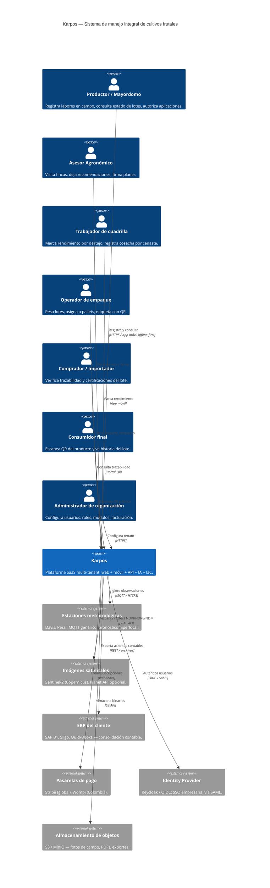

# C4 — Diagrama de Contexto (Karpos)

## Roles y aislamiento

Cada usuario pertenece a una o más **organizaciones** (tenants). Un usuario puede tener un rol distinto por organización. Los datos se aíslan por `org_id` mediante Row-Level Security en PostgreSQL — ver [ADR-0002](adr/0002-multitenancy.md).
